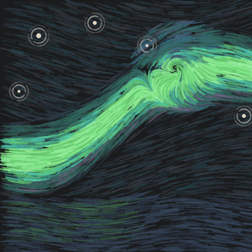

# Nordlys

Aurora over polar ocean night. A dark, low-contrast color theme for multiple tools, built around the aurora borealis: green literals glowing on a neutral graphite sky, cool blue structure, rare warm accents. *Nordlys* is Norwegian for the northern lights.

Nordlys grew out of [Nightworlds](https://github.com/feafarot/nightworlds).

## Ports

| Tool | Where | Install |
| --- | --- | --- |
| VS Code | [`vscode/`](vscode/) | Marketplace (soon), or `vsce package` inside `vscode/` and install the `.vsix` |
| JetBrains Rider | [`rider/Nordlys.icls`](rider/Nordlys.icls) | Settings → Editor → Color Scheme → ⚙ → Import Scheme |
| Windows Terminal | [`windows-terminal/nordlys.json`](windows-terminal/nordlys.json) | Add the object to `schemes` in Windows Terminal `settings.json`, then set `"colorScheme": "Nordlys"` |

The VS Code theme (`vscode/themes/Nordlys-color-theme.json`) is the source of truth; other ports are derived from it.

## Palette

| Role | Hex |
| --- | --- |
| Editor background |  `#1A1B1C` |
| Chrome / panels |  `#212223` |
| Widgets / menus |  `#28292A` |
| Foreground |  `#D4D4D4` |
| Comments |  `#5C6370` |
| Keywords, JSON/YAML keys |  `#6395C5` |
| Types / classes |  `#1CB7E3` |
| Interfaces |  `#3BA6C4` |
| Type parameters |  `#98B89D` |
| Properties / fields |  `#B6DDFD` |
| Methods (calls quiet, declarations bold) |  `#DDE3EA` |
| Strings & constants |  `#7EE787` |
| Numbers |  `#93EB9B` |
| String interpolation |  `#4EC9B0` |
| Decorators / attributes |  `#E5C07B` |
| Escapes & regex |  `#D688D4` |
| Macros / preprocessor |  `#E06C75` |

Full reference in [`palette/nordlys.scss`](palette/nordlys.scss).

## Preview

[`preview/index.html`](preview/index.html) renders C#, F#, TypeScript, JavaScript, PowerShell, Bash, JSX, HTML, XML and JSON samples straight from the theme file, resolving colors through the same semantic-first logic VS Code uses. Serve the repo root over HTTP and open `/preview/`:

```bash
npx -y http-server -p 5173 -c-1 .
```

Edit the theme, refocus the browser tab, and the page repaints. Hover any token to see its role, resolved scope, and hex.
